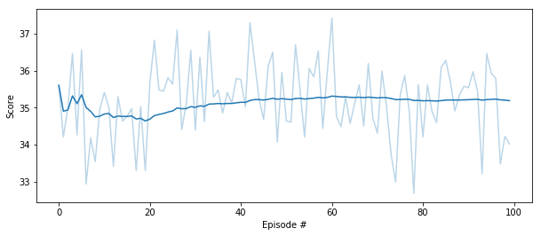

## Report

---

### Algorithm

To solve the problem, the algorithm Deep Deterministic Policy Gradient for Continuous Action-space [DDPG](https://arxiv.org/abs/1509.02971) was applied. The implementation is based on the Udacity [DDPG project](https://github.com/udacity/deep-reinforcement-learning/tree/master/ddpg-bipedal), which has been adapted to the Reacher environment.

The environment contains 20 identical agents, each with its own observations. The observations produced by these agents will then be stored in the shared replay buffer. This approach accelerates training by  gathering more experience at one time step.

The actor's network has the following setup:

- 256 units hidden layer with ReLU activation
- 128 units hidden layer with ReLU activation
- 256 units hidden layer with ReLU activation

The critics's network has the following setup:

- 256 units hidden layer with ReLU activation
- 256 (plus action size on input) units hidden layer with ReLU activation
- 128 units hidden layer with ReLU activation

Also, to prevent exploding gradients, a gradient norm clipping is applied to the critic's network.

The hyper parameters are:

- buffer size: 1000000
- batch size: 128       
- discount factor (gamma): 0.999         
- soft update factor (tau): 0.001           
- actor's learning rate: 0.0001
- critic's learning rate: 0.0003
- train steps: 20
- number of trainings: 20

### Training

The following diagram shows scores during training:

According to the diagram, the environment was solved after 200 episodes.

### Evaluation

The average score reaches about 35 (over 100 consecutive episodes, after taking the maximum over both agents)

### Future Work

- Conv1d instead of linear layers and stacking previous states (history) may improve the agent.
- Importance sampling for replay buffer may improve stability.
- Batch normalization and dropout layers can also improve stability.